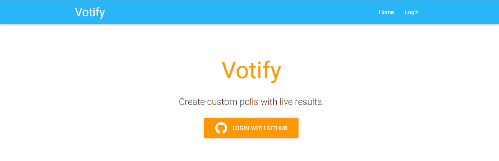

#Voting Application

This is a solution forhttps://www.freecodecamp.com/challenges/build-a-voting-app

User Story: As an authenticated user, I can keep my polls and come back later to access them.

User Story: As an authenticated user, I can share my polls with my friends.

User Story: As an authenticated user, I can see the aggregate results of my polls.

User Story: As an authenticated user, I can delete polls that I decide I don't want anymore.

User Story: As an authenticated user, I can create a poll with any number of possible items.

User Story: As an unauthenticated or authenticated user, I can see and vote on everyone's polls.

User Story: As an unauthenticated or authenticated user, I can see the results of polls in chart form. (This could be implemented using Chart.js or Google Charts.)

User Story: As an authenticated user, if I don't like the options on a poll, I can create a new option.

##Screenshot

###Landing Page

###Right upon logging in, the user is presented with a Dashboard and options to create a new poll. 

###On the My Polls page, a user can see all the polls that he or she has made.

###User is making a new poll.

###The user will see the newly created poll on My Polls. A shareable link is also given.

###When a user goes to the shareable link, the options are provided.

###After submitting an answer, the user will see a pie chart of the poll.

##Technologies Used:
- Node.js
- Express
- Chart.js
- Mongoose
- MongoDB